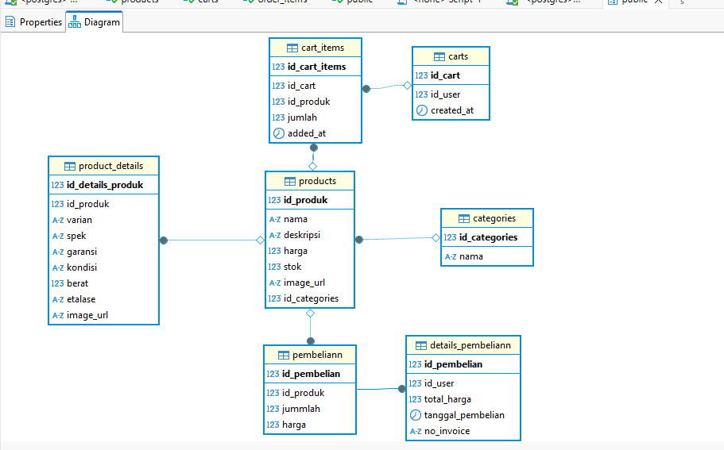

# Soal test maggang Backend engineer dengan Springboot

Berikut adalah soal/pertanyaan yang perlu dijawab oleh peserta maggang

## knowledge base

1. Apa yang anda ketahui tentang Rest API?

    REST (Representational State Transfer) API (Application Programming Interface) Rest API adalah antar muka yang digunakan untuk mengizinkan komunikasi dan pertukaran data antara berbagai perangkat lunak atau sistem di lingkungan jaringan komputer.
    REST API menggunakan metode HTTP (GET, POST, PUT, DELETE) dan URL untuk berinteraksi dengan sumber daya.
    Fungsi dari Rest API ini adalah memungkinkan aplikasi berkomunikasi dan bertukar data melalui jaringan. Ini digunakan untuk mengakses, mengirim, dan berinteraksi dengan data, layanan, dan aplikasi eksternal, seperti mengambil data cuaca, berbagi pesan di media sosial, atau melakukan pembayaran online. REST API juga memungkinkan integrasi antara aplikasi yang berbeda dan akses ke database.
    Singkatnya API adalah penghubung dan Rest API adalah Aturannya 

2. Apa yang anda ketahui tentang Server side and Client side processing?

    Server side adalah segala sesuatu yang terjadi di server, bukan di klien seperti merender halaman web dinamis, berinteraksi dengan basis data, autentikasi identitas, dan pemberitahuan push. jadi setiap permintaan yang melibatkan salah satu dari proses tersebut harus berjalan dari klien ke server, setiap saat. singkatnya Server Side adalah bagian dari pengembangan web yang terjadi di sisi server. Ini mencakup proses pengolahan, manipulasi, dan pengiriman data sebelum tampil di browser pengguna.

    sedangkan  Client side adalah program yang dijalankan pada perangkat klien atau pengguna.Pengembang client side bekerja pada bagian situs web yang dapat berinteraksi dengan pengguna.
    kebalikan dari server side , client side metode rendering nya di mana browser memproses permintaan akses, dan hanya file JavaScript yang digunakan untuk menghasilkan konten HTML.

3. Apa yang anda ketahui tentang Monolith dan Microservices, berikan contohnya?

    monolith adalah sebuah model arsitektur di mana sebuah sistem dibangun dalam satu codebase yang sama. Misalnya pada sebuah situs belanja online terdapat beberapa bagian fitur seperti otorisasi pengguna, keranjang belanja, pembayaran, pengiriman, dan lainnya. Keseluruhan fitur tersebut dibangun secara terintegrasi pada satu codebase yang sama.
    kelebihan dari monolith Pengembangan lebih mudah, testing debugging lebih mudah, dan Deployment lebih sederhana
        Contoh arsitektur monolith
        - web site ecommerce sederhan
            Sebuah web sederhana e-commerce yang hanya memiliki fungsi dasar seperti menampilkan produk, keranjang belanja, dan pemesanan, bisa jadi dibangun sebagai aplikasi monolitik.

    Microservices adalah pendekatan pengembangan perangkat lunak yang memecah aplikasi menjadi layanan-layanan kecil yang independen. Setiap layanan (service) memiliki fungsi spesifik, dapat dijalankan secara mandiri, dan berkomunikasi dengan layanan lain melalui API.
    Kelebihan Microservice adalah Lebih fleksibel dan mudah dikembangkan, Skalabilitas tinggi karena hanya layanan tertentu yang perlu ditingkatkan, dan Jika satu layanan gagal, layanan lain tetap berjalan normal.
        Contoh arsitektur microservice
            - amazon
            - shopee
            - netflix
            - spotify

4. Apa yang anda ketahui tentang Design pattern inversion of Control serta Dependency Injection?

    Design Pattern inversion of control adalah prinsip yang di mana alur kontrol program diserahkan ke framework atau container, bukan ditangani secara manual oleh kode kita. jadi Objek membuat atau mencari sendiri objek lain yang dibutuhkan untuk menjalankan tugasnya. kita pakai perumpamaan Misalnya, sebuah kelas Mobil mungkin membuat objek Mesin secara langsung di dalam konstruktornya. 
    keuntungan menggunakan IOC adalah design lebih baik dan mudah di maintain

    sedangkan Depedency Injection adalah pola desain yang menerapkan Dependency Inversion Principle dengan menyuntikkan dependensi alih-alih membuatnya di dalam kelas . jadi DI ini mengatur bagaimana suatu objek di bentuk ketika terdapat objek lain yang membuntuhkan. tujuan dari DI ini untuk memisahkan bagian-bagian program yang menangani permasalahan yang berbeda

5. Apa yang anda ketahui tentang Java programming dan Spring framework khususnya spring-boot?

    Tentu saja Java adalah bahasa pemrograman berorientasi objek (OOP), terkenal karena stabilitas dan digunakan secara luas di aplikasi enterprise, Android, backend, dll.
    Java merupakan bahasa multiplatform yang berorientasi pada objek dan berpusat pada jaringan yang dapat digunakan sebagai platform di dalamnya. Java merupakan bahasa pemrograman yang cepat, aman, dan andal untuk mengodekan segala sesuatu mulai dari aplikasi seluler dan perangkat lunak korporasi hingga aplikasi big data dan teknologi sisi server.
    kegunaan dari java banyak sekali seperti IOT, Perkembangan game, Komputasi cloud dll.

    Spring Framework adalah framework open  source berbasis java yang menyediakan infrastruktur yang komprehensif dalam mengembangkan aplikasi java dengan mudah dan cepat selain itu fleksibel dan terstruktur . Fitur utama termasuk IoC, AOP, dan Transaction Management.
    Spring Boot merupakan salah satu jenis framework dari Spring. Spring Boot adalah framework Java yang memudahkan pengembangan aplikasi, terutama untuk layanan mikro, dengan menghilangkan konfigurasi manual yang rumit.
    manfaat dari springboot ini adalah salah satu nya cepat dan ringan selain itu Pengembangan Berbasis Cloud, gratis dan open source

## Design modules

Dalam suatu schenario ada requirement membuat aplikasi e-commerse seperti Tokopedia seperti berikut:

1. Catalog, pelanggan mencari product di toko
    
2. Item, bisa melihat detail informasi produk
    
3. Cart, pelanggan bisa menambahkan produk yang ingin di beli ke keranjang
    
4. Setelah di checkout, masuk ke list transaction
    
5. Kita juga bisa liat detail transactionya
    

Kemudian temen-temen buat design database, module (monolith/microservices) berdasarkan gambar atau schenario tersebut. Serta jelakan mengapa menggunakan design tersebut.

Design Database nya seperti Ini : 

dan module yang saya pilih tentunya monolith karena kesederhanaan dalam pengembangan, pengujian, dan penerapan, terutama untuk proyek skala kecil hingga menengah dengan kebutuhan kompleksitas rendah. Keuntungan lain termasuk kemudahan pemahaman kode, debugging yang lebih cepat, dan biaya yang lebih rendah pada tahap awal pengembangan. 

## Praktek

Berdasarkan analisa tersebut, buat project monorepo (pada repository ini) dengan menggunakan framework springboot seperti berikut specifikasinya:

- Database: `PostgreSQL 15`
- JDK version: `Oracle JDK 17 or later`
- Springboot version: `3.0.x`

terkait design system Toko, Barang, Pembelian pada ecommerse tersebut.