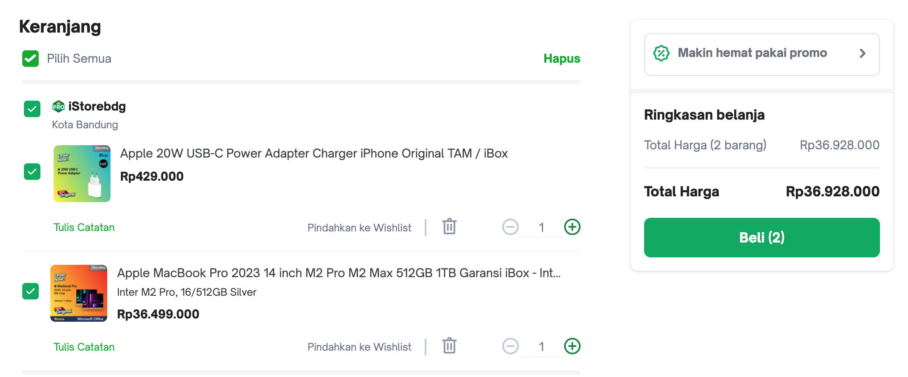

# Soal test maggang Backend engineer dengan Springboot

Berikut adalah soal/pertanyaan yang perlu dijawab oleh peserta maggang

## knowledge base

1. Apa yang anda ketahui tentang Rest API?
    REST (Representational State Transfer) API (Application Programming Interface) Rest API adalah antar muka yang digunakan untuk mengizinkan komunikasi dan pertukaran data antara berbagai perangkat lunak atau sistem di lingkungan jaringan komputer.
    REST API menggunakan metode HTTP (GET, POST, PUT, DELETE) dan URL untuk berinteraksi dengan sumber daya.
    Fungsi dari Rest API ini adalah memungkinkan aplikasi berkomunikasi dan bertukar data melalui jaringan. Ini digunakan untuk mengakses, mengirim, dan berinteraksi dengan data, layanan, dan aplikasi eksternal, seperti mengambil data cuaca, berbagi pesan di media sosial, atau melakukan pembayaran online. REST API juga memungkinkan integrasi antara aplikasi yang berbeda dan akses ke database.
    Singkatnya API adalah penghubung dan Rest API adalah Aturannya 

2. Apa yang anda ketahui tentang Server side and Client side processing?
    Server side adalah segala sesuatu yang terjadi di server, bukan di klien seperti merender halaman web dinamis, berinteraksi dengan basis data, autentikasi identitas, dan pemberitahuan push. jadi setiap permintaan yang melibatkan salah satu dari proses tersebut harus berjalan dari klien ke server, setiap saat. singkatnya Server Side adalah bagian dari pengembangan web yang terjadi di sisi server. Ini mencakup proses pengolahan, manipulasi, dan pengiriman data sebelum tampil di browser pengguna.

    sedangkan  Client side adalah program yang dijalankan pada perangkat klien atau pengguna.Pengembang client side bekerja pada bagian situs web yang dapat berinteraksi dengan pengguna.
    kebalikan dari server side , client side metode rendering nya di mana browser memproses permintaan akses, dan hanya file JavaScript yang digunakan untuk menghasilkan konten HTML.

3. Apa yang anda ketahui tentang Monolith dan Microservices, berikan contohnya?

4. Apa yang anda ketahui tentang Design pattern inversion of Control serta Dependency Injection?

5. Apa yang anda ketahui tentang Java programming dan Spring framework khususnya spring-boot?

## Design modules

Dalam suatu schenario ada requirement membuat aplikasi e-commerse seperti Tokopedia seperti berikut:

1. Catalog, pelanggan mencari product di toko
    
2. Item, bisa melihat detail informasi produk
    
3. Cart, pelanggan bisa menambahkan produk yang ingin di beli ke keranjang
    
4. Setelah di checkout, masuk ke list transaction
    
5. Kita juga bisa liat detail transactionya
    

Kemudian temen-temen buat design database, module (monolith/microservices) berdasarkan gambar atau schenario tersebut. Serta jelakan mengapa menggunakan design tersebut.

## Praktek

Berdasarkan analisa tersebut, buat project monorepo (pada repository ini) dengan menggunakan framework springboot seperti berikut specifikasinya:

- Database: `PostgreSQL 15`
- JDK version: `Oracle JDK 17 or later`
- Springboot version: `3.0.x`

terkait design system Toko, Barang, Pembelian pada ecommerse tersebut.